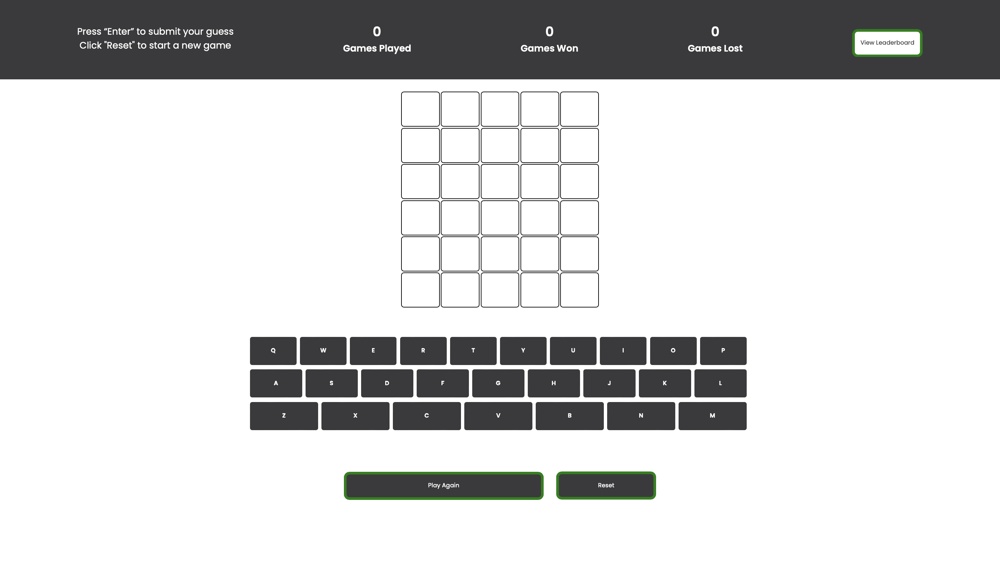
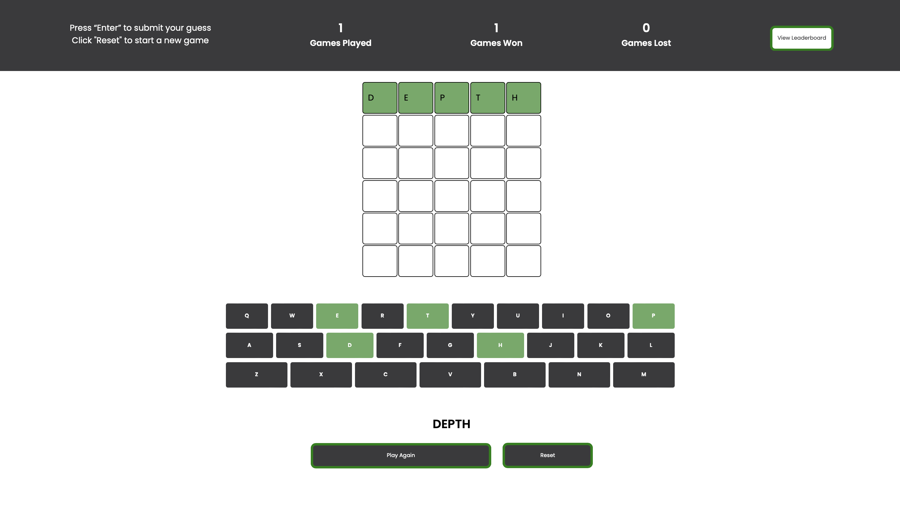
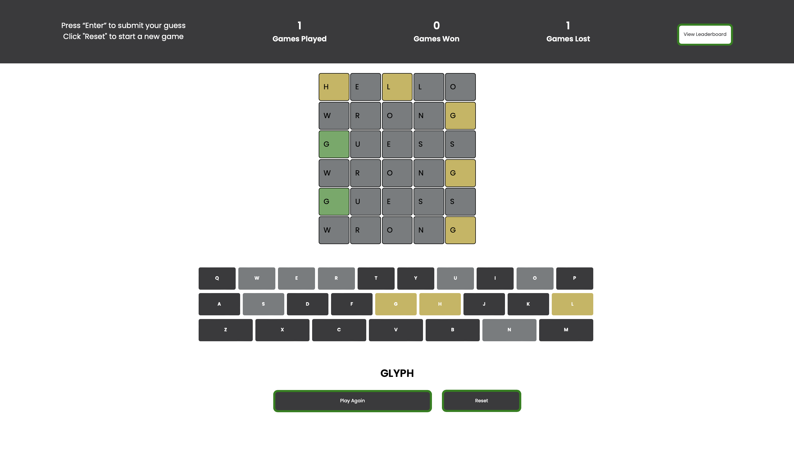

# Wordle - CSI3140

## _**For Assignment 2 grading, please see the ‘versions/v01’ folder which contains the files intended for Assignment 2 submission.**_

A simple Wordle game built using HTML, CSS, JavaScript and PHP.

## Game Description

- The objective of the game is to guess a 5-letter word within six attempts
- Feedback on the player's attempt is provided by highlighting letters:
	- Green: correct letter in the correct position
	- Yellow: correct letter in the wrong position
	- Gray: incorrect letter
- After exhausting all attempts, the word will be revealed to the player & can play again
- The game features a leaderboard showing the user's top 10 highest number of consecutive wins. The leaderboard updates after the user loses a round.

## Playing the Game 

1. Clone this repository 
2. In the terminal, navigate to the project directory (i.e. 'wordle')
3. In the terminal, run the command 'php -S localhost:8000'
4. In your web browser of choice, navigate to 'http://localhost:8000/index.html'
5. Use your physical keyboard to enter guesses and press the "Enter" key to submit an attempt

## Game States
### Initial State

### Correct Guess

### Incorrect Guess

### Leaderboard

