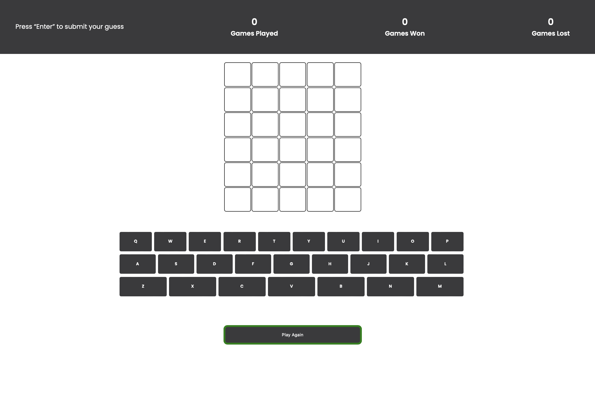
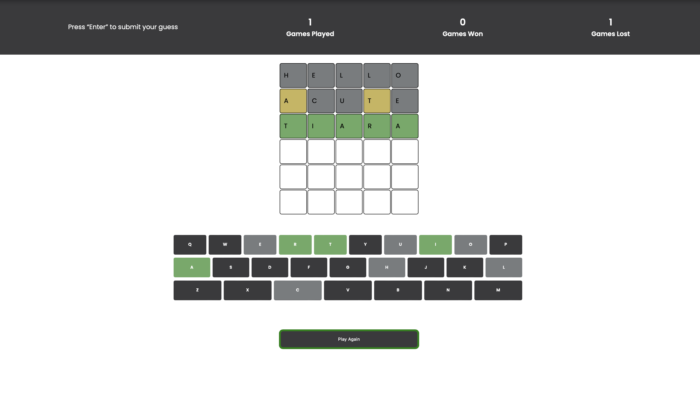
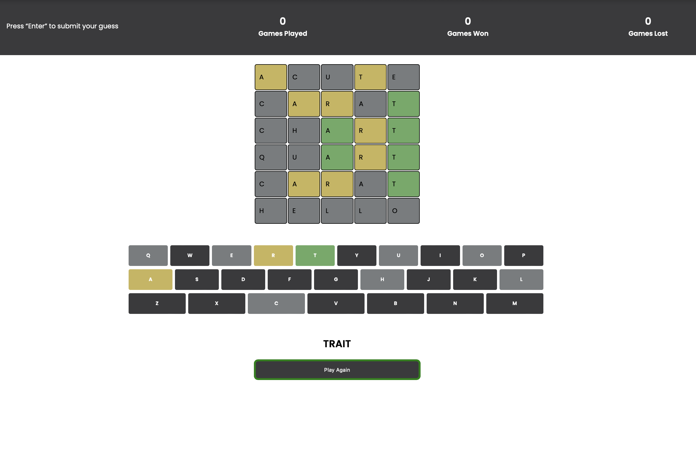
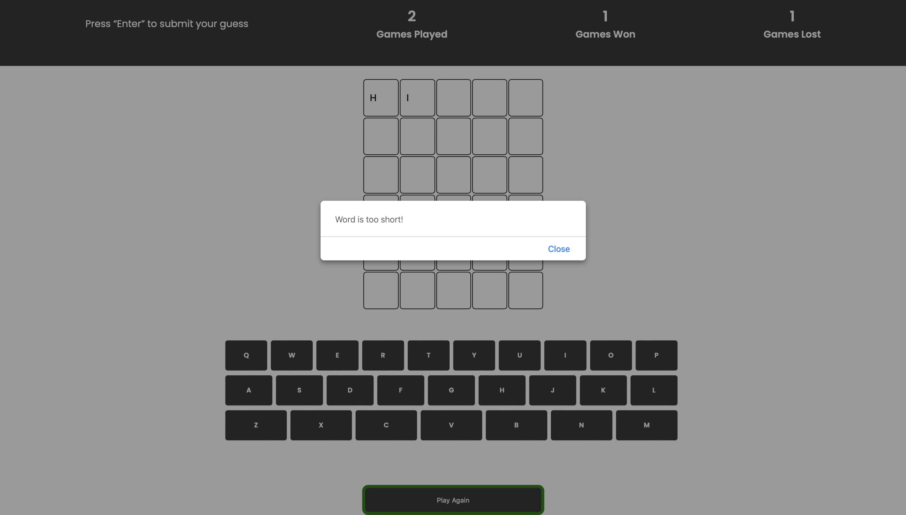

# Wordle - CSI3140 Assignment 2

A simple Wordle game built using HTML, CSS and JavaScript

## Game Description

- The objective of the game is to guess a 5-letter word within six attempts
- Feedback on the player's attempt is provided by highlighting letters:
	- Green: correct letter in the correct position
	- Yellow: correct letter in the wrong position
	- Gray: incorrect letter
- After exhausting all attempts, the word will be revealed to the player & can play again

## Playing the Game 

1. Clone this repository 
2. Navigate to the project directory 
3. Open index.html in your web browser of choice
4. Use your physical keyboard to enter guesses and press the "Enter" key to submit an attempt

## Game States
### Initial State

### Correct Guess

### Incorrect Guess

### Alert Message for Short Guess

## Debugging 
If you need to see the word for testing purposes, uncomment lines #26 and #182 in main.js to view the word in console.

## References
- List of 5-letter words is generated by ChatGPT

