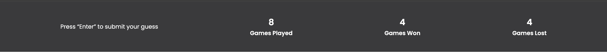
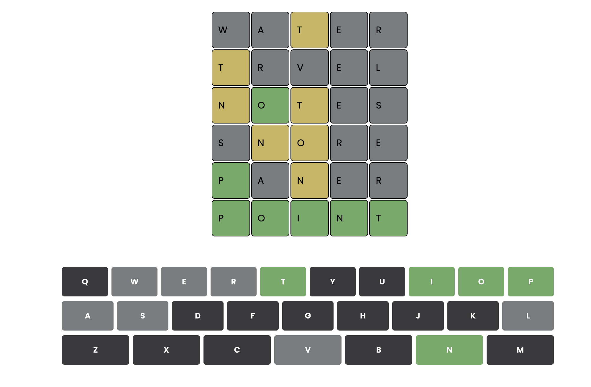

# Assignment 2: Wordle Game (JavaScript, HTML, CSS)

This document outlines the design system for the web-based game, Wordle. 

## Fonts
- **Primary Font:** "Poppins", 'Lucida Sans', 'Lucida Sans Regular', 'Lucida Grande', 'Lucida Sans Unicode', Geneva, Verdana, sans-serif

## Colours
### Primary Colours
- **Primary Colour:** White
- **Secondary Colour:**  rgb(58, 58, 60)

### Status Colours
- **Correct letter colour:** #6aaa64
- **Present letter colour:**  #c9b458
- **Absent letter colour:**  #787c7e

## Components
### Header and Scoreboard

### Play Area

